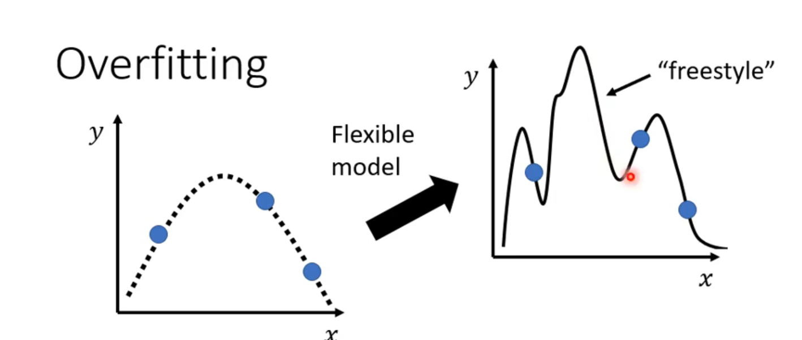
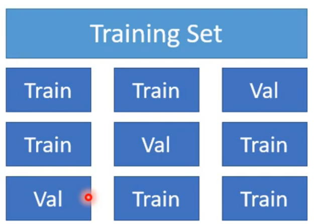
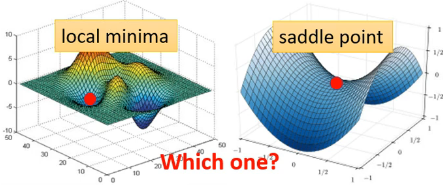
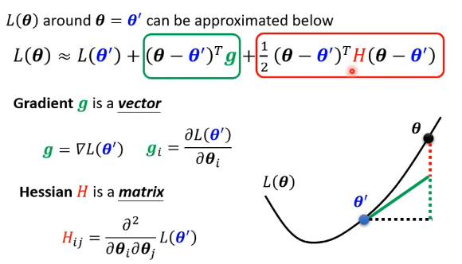
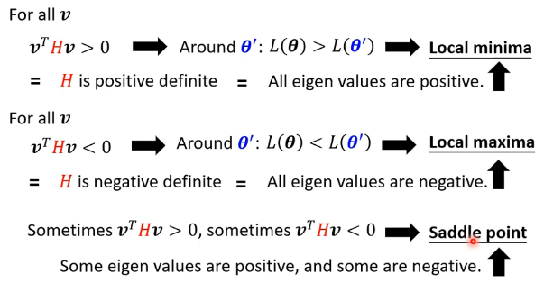
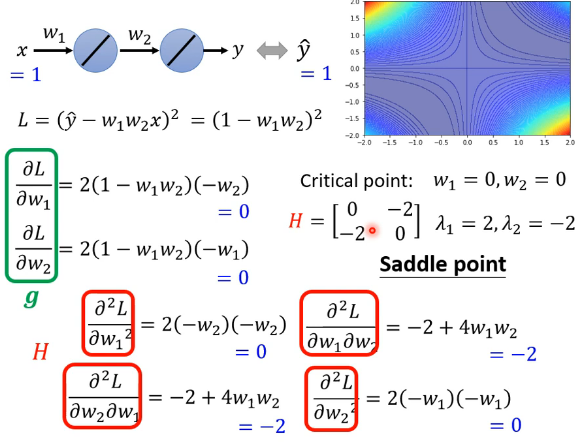
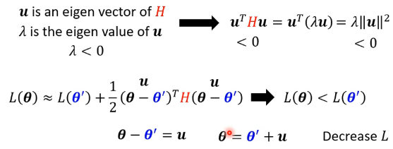

### 1. 预测本频道观看人数

### 2. 机器学习任务攻略

#### overfitting 解决办法：
 1. 增加训练集
 2. 不让模型有太大弹性，限制模型（）

### 3. 机器学习任务攻略

optimization issue 不是过拟合
过拟合——>train loss min 但是 test loss max
overfitting 模型弹性大

#### Data augmentation：（增加数据集，避免过拟合）

 1. 左右翻转图片，镜像等等；
 2. model 写限制 比较小的神经元数目，早结束，丢弃，较少特征。

#### N-fold Cross Validation
分成不同分，然后做多次，每次tarin与val不一样

#### Mismatch
训练资料与测速资料不一样

### 4. 局部最小值(Loacl Minima)与鞍点(Saddle point)
local minima 是最低，saddle point不是最低，还可以使loss降低

  

 critical piont 临界点，一阶导为0，所以只看后面红色部分。
 

 H是矩阵Haition  
  
  
   H的特征值 小于零 可以找更低loss点 
   
