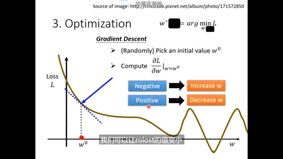
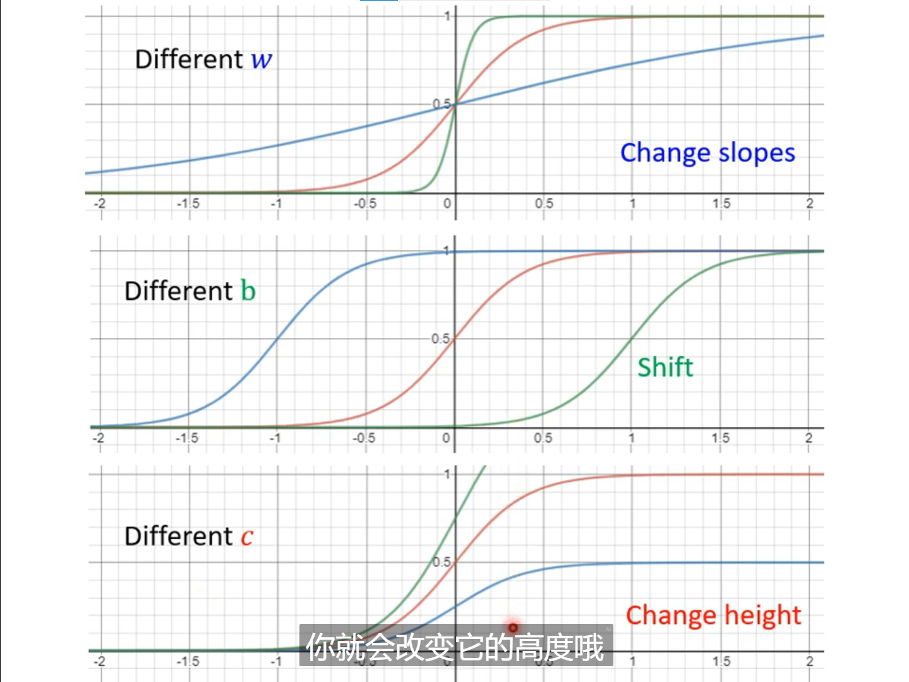
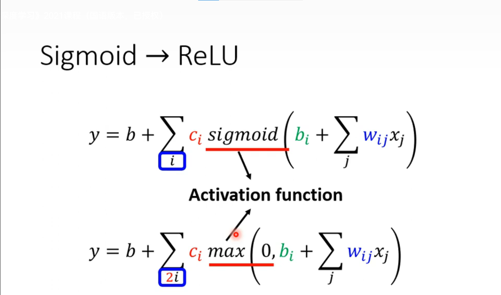

----------

### 1. 预测本频道观看人数

### 2. 机器学习任务攻略

#### overfitting 解决办法：
 1. 增加训练集
 2. 不让模型有太大弹性，限制模型（）

### 3. 机器学习任务攻略

optimization issue 不是过拟合
过拟合——>train loss min 但是 test loss max
overfitting 模型弹性大

#### Data augmentation：（增加数据集，避免过拟合）

 1. 左右翻转图片，镜像等等；
 2. model 写限制 比较小的神经元数目，早结束，丢弃，较少特征。

#### N-fold Cross Validation
分成不同分，然后做多次，每次tarin与val不一样

#### Mismatch
训练资料与测速资料不一样

### 4. 局部最小值(Loacl Minima)与鞍点(Saddle point)
local minima 是最低，saddle point不是最低，还可以使loss降低

  

 critical piont 临界点，一阶导为0，所以只看后面红色部分。
 

 H是矩阵Haition  
  
  
   H的特征值 小于零 可以找更低loss点 
   
   
   
二维空间的 local minima 不一定是最低，可以看高纬度，说不定就是saddle point 
local minima并没有那么常见，多数还是saddle point

### 5. 批次（batch）与动量（Momentum）
#### Batch
==epod #619AC3==：计算loss不是所有资料，只会拿一个batch计算，然后再更新，所有batch计算之后叫一个epod
==shuffle #619AC3==：每一个epod的batch不一样
使用batch——> 每一个batch 都会更新数据
不使用batch

| 不使用batch            | 使用batch        |
| ---------------------- | ---------------- |
| 蓄力时间长，威力比较大 | 技能快，比较不准 |
平行计算，不使用batch所使用的时间不一定大
==一个epoch大的batch花的时间反而是比较少的 #EE3F4D==

==大的batch size 结果不行，小的batch size 结果反而更好。不是overfitting #EE3F4D==
>可能的解释：full batch 没有办法更新参数，但是small batch可以更新参数，每次的loss都是有差异的

小的 batch 在testing 结果会更差：small batch 与large batch在training时相同准确率，但是在testing时 small batch准确率反而不好。如果small batch在testing 中效果不好——>==overfitting #619AC3==
>large batch——>走向小峡谷里面
>small batch——>走向大盆地里面，方向多

#### Momentum
 gradient的方向加上前次移动方向
  
  
  
### 6. 自动调整学习速率（Learning Rate）
某一个方向上gradient值很小，非常平坦——>learning rate 调大
某一个方向上gradient值很大，非常陡峭——>learning rate 调小

#### Adaptive

#### RMSProp

Adam：RMSProp + Momentum

Adaptive结果：

解决办法： 
 1. Learing Rate Decay，随着时间不断进行，随着参数不断update，让这个 值越来越小

2.  Warm Up，先变大参数，后变小

### 7. 损失函数（Loss）

Loss of Classification

Minimizing cross-entropy is equivalent to maximizing likelihood
两个是一模一样的东西
 ==cross-entropy 更加适合用在分类问题（ptorch会自动把soft max加在network的最后一层） #619AC3==
 
 
 ### 8. 批次标准化（Batch Normalization）
 
 
 
 
 
 
