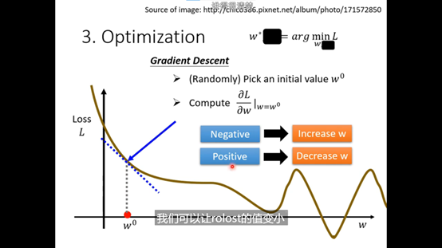
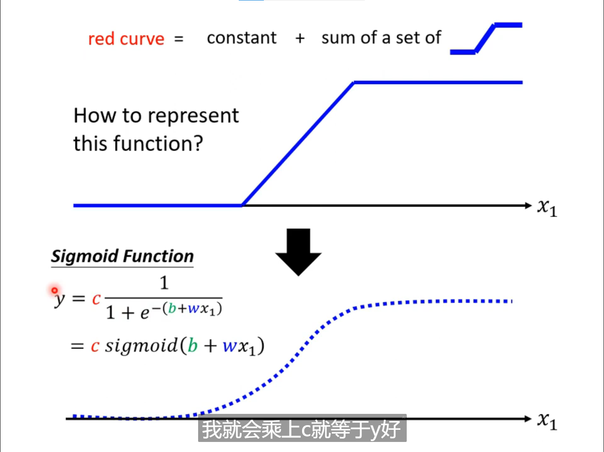
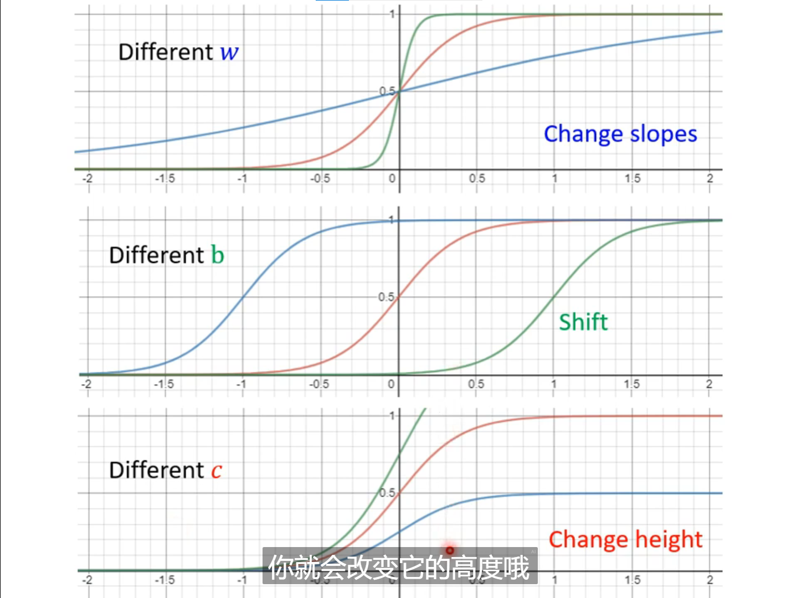
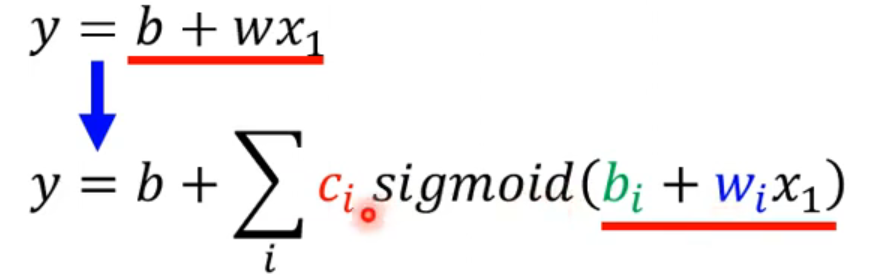
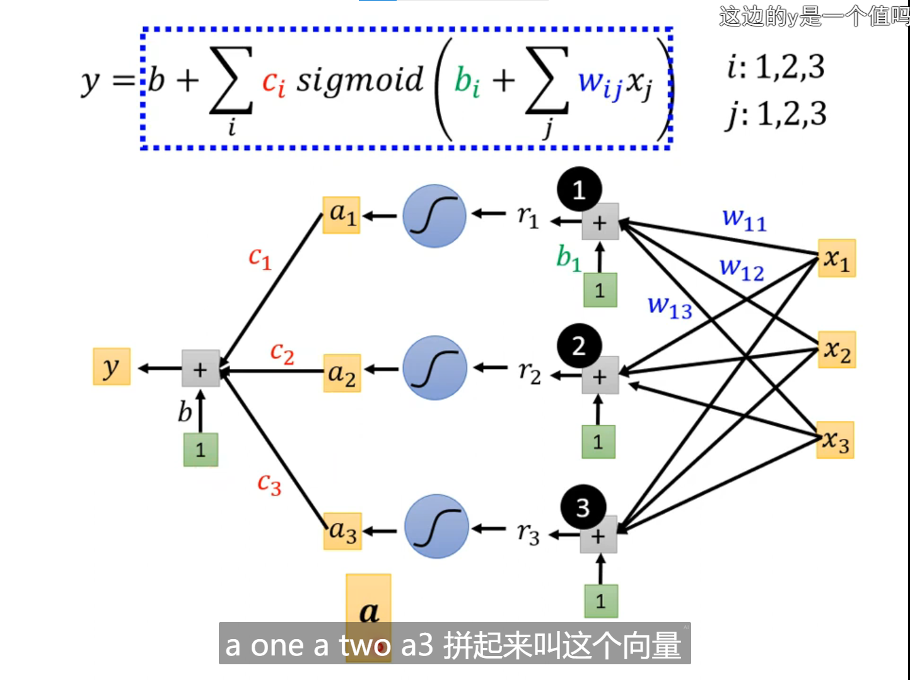
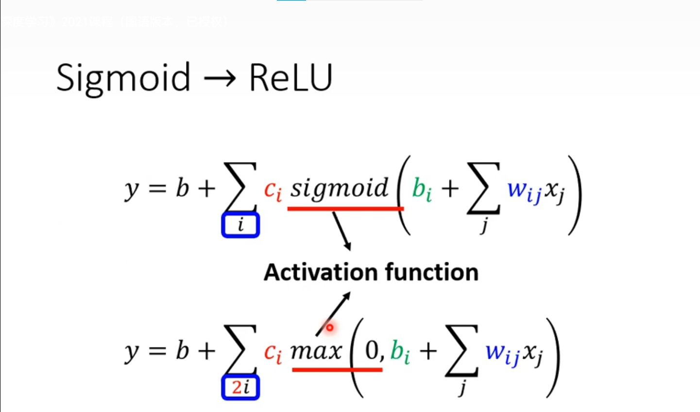
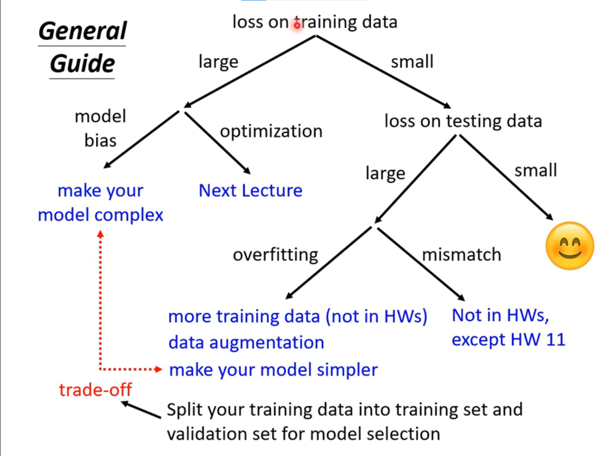
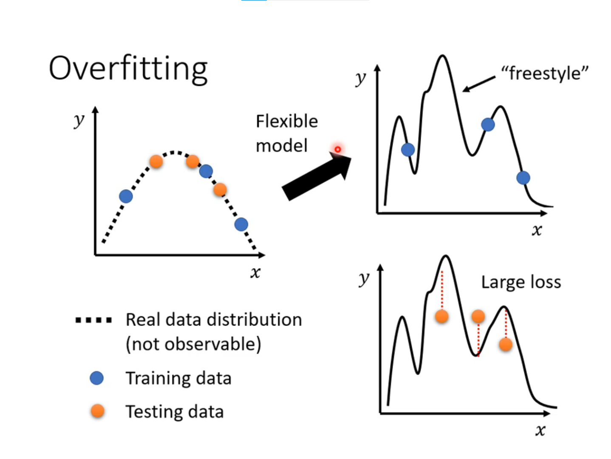
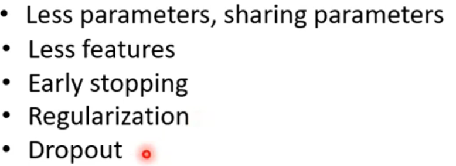

----------

### 1. 预测本频道观看人数

### 2. 机器学习任务攻略

#### overfitting 解决办法：
 1. 增加训练集
 2. 不让模型有太大弹性，限制模型（）

### 3. 机器学习任务攻略

optimization issue 不是过拟合
过拟合——>train loss min 但是 test loss max
overfitting 模型弹性大

